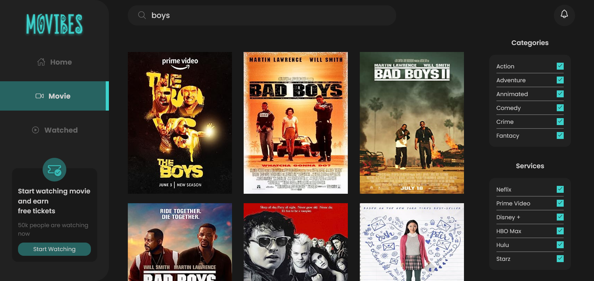

# Movibes Movie Application

This is a solution to the [UI Design](https://www.figma.com/file/lBPMzecfIv2qIN2uCVBeoD/Movibes-Website-(Community)?type=design&node-id=158-2&mode=design&t=T3dDdIjRmZZck3OP-0). This is built for user who loves watching movies and don't have a go to application to search for a movie to watch.

## Table of contents

- [Overview](#overview)
  - [Development](#development)
  - [The challenge](#the-challenge)
  - [Screenshot](#screenshot)
  - [Links](#links)
- [My process](#my-process)
  - [Built with](#h)
  - [What I learned](#what-i-learned)
  - [Continued development](#continued-development)
  - [Useful resources](#useful-resources)
- [Author](#author)
- [Contributing](#Contributing)
- [Show-support](#Showyoursupport)
- [Acknowledgments](#Acknowledgments)


## Overview

### Development (Running locally)

- Clone the project

```bash
git clone https://github.com/harzeezco/Movibes.git

```

- Install Dependencies

```bash
npm install
```

To run StyleLint by itself, you may run the lint task:

```bash
npm run lint:check
```

Or to automatically fix issues found (where possible):

```bash
npm run lint
```

You can also check against Prettier:

```bash
npm run format:check
```

and to have it actually fix (to the best of its ability) any format issues, run:

```bash
npm run format
```

You can also check against HTML Validator:

```bash
npm run html-validator
```

### The challenge

Users should be able to:

- View the optimal layout for the app depending on their device's screen size
- See hover states for all interactive elements on the page
- Search for Movies
- Check Movie Details
- Add Movie to Watched list
- Rate Movie 
- Like the Movie
- Delete Movie from Watched list
- **Bonus**: Sort watched movies

### Screenshot





### Links

- Solution URL: [Add solution URL here](https://your-solution-url.com)
- Live Site URL: [Add live site URL here](https://your-live-site-url.com)

## My process

### Built with

- Semantic HTML5 markup
- CSS custom properties
- Flexbox
- CSS Grid
- [React](https://reactjs.org/) - JS library
- [Styled Components](https://styled-components.com/) - For styles
- [React Router Dom](https://reactrouter.com/) - For Route
- [eslint](https://eslint.org/) - for linting


### What I learned

I learned how to create a fully functional application which deals with APIs


### Useful resources

- [How to make React application faster](https://kentcdodds.com/blog/state-colocation-will-make-your-react-app-faster) - This helped me in how to make a React application faster. I really liked this pattern and will use it going forward.
- [React optimization](https://alexsidorenko.com/blog/react-optimize-rerenders-without-refs-memo/) - This is a must look out blog for anyone optimizing a React appication.
- [Guildelines to take when building React application](https://github.com/mithi/react-philosophies?ref=jonas.io) - This is an amazing article which helped me finally understand how real world React application are built. I'd recommend it to anyone still learning how to build React application.
- [Web accessibilty](https://www.w3.org/WAI/fundamentals/) - This is absolutely for all developers. This shrpens your web accessibily skills which is some of the best things to consider on the user of the application.


## 👤 Author

### Wakil Azeez

- Github: [@wakil-azeez](https://github.com/harzeezco)
- Twitter: [@wakil-azeez](https://twitter.com/Wkhayzed)
- INSTAGRAM: [@wakil-azeez](https://www.instagram.com/wakil_abdul_azeez/)


## 🤝 Contributing

Contributions, issues and feature requests are welcome!

Feel free to check the [issues page](../../issues).

## Show your support

Give a ⭐️ if you like this project!

## Acknowledgments

- [W3c](https://www.w3.org/)

## 📝 License

[MIT licensed](./LICENSE).


